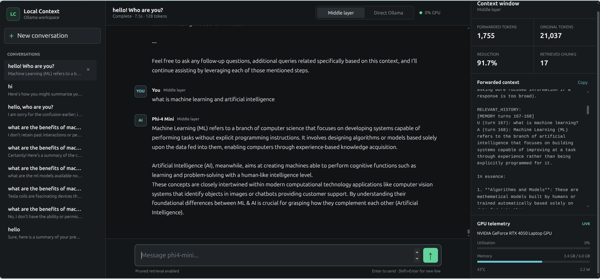

# Ollama RAG Memory

Give local Ollama models access to long conversation history without sending
the entire chat on every request.

Ollama RAG Memory is a local FastAPI proxy that stores complete conversations,
finds history relevant to the current question, and forwards a smaller,
coherent context to Ollama.



## The problem

Large context windows can make local inference slow and memory-intensive.
Sending the same 32K or 128K conversation repeatedly means Ollama must process
many old tokens that may have nothing to do with the current request.

This project uses:

- **SQLite** to preserve the complete conversation;
- **ChromaDB** to index ordered conversation chunks;
- **nomic-embed-text** to find relevant older history;
- **token budgets** to control how much context reaches the chat model.

The full history remains on your machine. Only recent and relevant information
is sent back to the model.

## What makes it useful

- **Ollama-compatible API** — use the middleware as the Ollama base URL.
- **Fully local** — no hosted model or external memory service is required.
- **Complete history** — the vector database is an index; SQLite remains the
  source of truth.
- **Coherent retrieval** — matching chunks expand to nearby chunks and their
  user/assistant exchange instead of returning isolated sentences.
- **Follow-up awareness** — short prompts such as “implement it” are combined
  with the previous request for retrieval.
- **Recent + relevant memory** — immediate conversation and older memories use
  separate token budgets.
- **Safe fallback** — if retrieval fails, a bounded recent-history window is
  still forwarded.
- **Visible results** — the UI shows the exact forwarded context, approximate
  token reduction, retrieved chunks, and optional NVIDIA GPU telemetry.
- **Comparison mode** — switch between RAG memory and direct full-history
  Ollama requests.

## How it works

```text
User or Ollama-compatible client
              |
              v
     Ollama RAG Memory :8000
              |
       +------+------+
       |             |
       v             v
 SQLite history   nomic-embed-text :8002
       |             |
       +--> ChromaDB <+
              |
       relevant chunk matches
              |
    neighboring chunks + turn pair
              |
      recent/retrieved budgets
              |
              v
        Chat Ollama :8001
```

For each request:

1. The complete user and assistant turns are stored locally.
2. Long turns are split into ordered, overlapping chunks.
3. Chunks are embedded and stored in ChromaDB with conversation and turn IDs.
4. The new request is embedded as a search query.
5. ChromaDB returns matches from that conversation only.
6. Each match expands to neighboring chunks and, optionally, its complete
   user/assistant exchange.
7. Recent turns and retrieved memories are fitted into configurable budgets.
8. The optimized context and current request are sent to the chat model.

History is not stored as one giant vector. Small ordered chunks produce better
retrieval and allow the original conversation around a match to be restored.

## Quick start

### Requirements

- Linux
- Python 3.12 or newer
- [Ollama](https://ollama.com/)

### Install and run

```bash
git clone https://github.com/ZeeshanGeoPk/ollama-rag-memory.git
cd ollama-rag-memory

python3 -m venv .venv
source .venv/bin/activate
pip install -e ".[dev]"
cp .env.example .env

python main.py
```

Open:

```text
http://127.0.0.1:8000
```

The first startup may take longer because Ollama downloads the configured chat
and embedding models when they are missing.

You can also launch the installed command:

```bash
ollama-middle-layer
```

## Demo

The easiest way to demonstrate retrieval is:

1. Select **Middle layer**.
2. Tell the model a specific decision:

   ```text
   We chose PostgreSQL because the project needs transactional migrations.
   ```

3. Send enough unrelated messages for that decision to move outside the recent
   context window.
4. Ask:

   ```text
   Which database did we choose, and why?
   ```

5. Inspect the **Context window** panel. It shows the recalled history and
   original versus forwarded token estimates.
6. Switch to **Direct Ollama** to compare RAG memory with sending the complete
   transcript.

## Use it as an Ollama-compatible API

Use this base URL:

```text
http://127.0.0.1:8000
```

Pass a stable `conversation_id` so each chat has isolated memory:

```bash
curl http://127.0.0.1:8000/api/chat \
  -H "Content-Type: application/json" \
  -d '{
    "model": "phi4-mini:3.8b",
    "conversation_id": "demo-project",
    "stream": false,
    "messages": [
      {
        "role": "user",
        "content": "Which database did we choose and why?"
      }
    ]
  }'
```

Clients may also place the ID inside `options`:

```json
{
  "options": {
    "conversation_id": "demo-project"
  }
}
```

Generic API clients should continue sending their normal transcript. The
middleware detects the already-stored prefix and indexes only unseen turns.
The included UI persists completed user and assistant turns automatically.

## Preview retrieved context

Inspect the context without generating an answer:

```bash
curl --get http://127.0.0.1:8000/debug/context-preview \
  --data-urlencode "conversation_id=demo-project" \
  --data-urlencode "q=Which database did we choose?"
```

The response includes raw vector matches, reconstructed memories, recent
context, approximate token counts, and reduction percentage.

## Configuration

Copy `.env.example` to `.env`. Every variable is documented inline.

The most useful tuning options are:

| Variable | Effect |
|---|---|
| `RECENT_TURNS_TO_KEEP` | Number of newest turns handled as immediate context. |
| `RETRIEVAL_TOP_K` | Number of vector matches requested from ChromaDB. |
| `RETRIEVAL_CHUNK_NEIGHBORS` | Number of chunks restored around a match. |
| `RETRIEVAL_INCLUDE_TURN_PAIR` | Keeps matching questions and answers together. |
| `SENTENCE_SCORE_THRESHOLD` | Controls recent-turn pruning aggressiveness. |
| `MAX_CONTEXT_TOKENS` | Overall approximate forwarded-context budget. |
| `RECENT_CONTEXT_TOKENS` | Budget for recent conversation. |
| `RETRIEVED_CONTEXT_TOKENS` | Budget for older retrieved memory. |
| `OLLAMA_BOOTSTRAP` | Starts Ollama and pulls missing models when enabled. |

Token counts use a fast character-based estimate rather than a model-specific
tokenizer.

## Main API endpoints

| Endpoint | Purpose |
|---|---|
| `POST /api/chat` | Ollama-compatible chat with RAG memory. |
| `POST /api/generate` | Ollama-compatible text generation. |
| `POST /api/embed` | Proxies the current Ollama embedding API. |
| `POST /api/embeddings` | Proxies the legacy embedding API. |
| `GET /api/tags` | Lists models from the chat Ollama server. |
| `GET /health` | Shows configured services and models. |
| `GET /debug/context-preview` | Shows retrieved and forwarded context. |
| `POST /admin/reset` | Clears conversations and indexed memory. |

Interactive API documentation:

```text
http://127.0.0.1:8000/docs
```

## Project structure

```text
src/ollama_middle_layer/
├── app.py               FastAPI routes, proxying, UI API, and streaming
├── context_pipeline.py  Retrieval, memory reconstruction, and token budgets
├── storage.py           SQLite history and ChromaDB index
├── pruning.py           Chunking, scoring, compaction, and token limits
├── ollama_clients.py    Ollama clients and embedding prefixes
├── bootstrap.py         Local Ollama process and model management
├── config.py            Environment configuration
├── gpu.py               Optional NVIDIA telemetry
└── web/                 Browser interface
```

## Tests

```bash
pytest -q
```

Tests cover storage, chunk expansion, question/answer pairing, pruning,
conversation isolation, API schemas, streaming persistence, bootstrap behavior,
and GPU fallback.

## Current limitations

- Token counts are approximate.
- Retrieval quality depends on the embedding model, chunk boundaries, and
  configured budgets.
- Global-history questions are detected with lightweight text patterns.
- Chroma results are not yet reranked with a cross-encoder.
- The service has no authentication or TLS. Keep it on localhost unless it is
  protected by a secure reverse proxy.
- GPU telemetry uses `nvidia-smi`, although inference itself does not require
  an NVIDIA GPU.

## Roadmap

- Hybrid keyword and vector retrieval.
- Configurable chunk size and overlap.
- Retrieval quality and latency benchmarks.
- Docker and system service examples.

## License

Licensed under the [Apache License 2.0](LICENSE).

Ollama models and downloaded model weights retain their own licenses.

## Contributing

Issues and pull requests are welcome, especially for retrieval benchmarks,
additional embedding models, tokenizer support, alternative vector stores, and
deployment examples.
